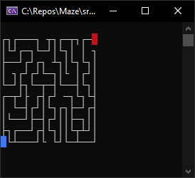
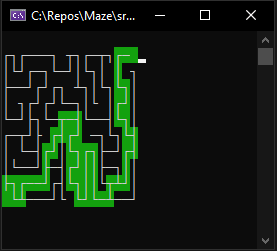

# Maze

This project is a simple 2D maze generator and solver.

It's purpose is to demonstrate maze generation and pathfinding algorithms using a simple game.

## The Game
The game generates a maze and allows you to move around it with the **arrow keys** to solve it. Your position is represented by the blue rectangle and the goal is to reach the red position.



If you press the **Enter key**, the game solves the maze automatically, from whatever position you're at.



When you solve a maze, a bigger one is generated.

### Running the Game
1. Clone this repository.
1. Open the `Anazing.sln` file located in `src/` using Visual Studio.
1. Setup the **ConsoleMaze** project as the startup project.
1. Hit **F5**.

Note that you may also provide a specific maze size via command line argument.
```shell
C:\Repos\Maze\src\ConsoleMaze\bin\Debug\net7.0> .\ConsoleMaze.exe 10
```

## The Code
It consists of 2 projects:
- The `Amazing` librairy contains the maze-making and maze-solving code.
  - The algorithms for maze generation and maze solving are located in `IMaze.cs`.
- The `ConsoleMaze` console application demonstrates the features by implementing a simple maze game.

## Notes
This is an old project from 2014 that I migrated to .NET 7 and C# 11.

